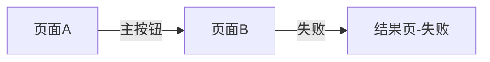

# PRD 输出模板

Agent 输出 PRD 时必须按此结构填写。无内容的可选章节写「无」或「不适用」，不要删除章节标题。

---

```markdown
# [功能/页面名称] — 需求文档

> 版本：v0.1  
> 状态：draft | 已确认（UI/Figma 生成前须为「已确认」，或用户在对话中口头批准）  
> 梳理日期：YYYY-MM-DD  
> 关联 skill：requirements-analysis → ui-page-generation

## 1. 背景与目标

### 1.1 背景
[为什么做这件事，业务驱动是什么]

### 1.2 目标
- [可衡量的目标 1]
- [可衡量的目标 2]

### 1.3 不在范围内
- [明确不做的事]

## 2. 用户与场景

| 用户类型 | 场景 | 触发入口 |
|----------|------|----------|
| [如：新用户] | [如：首次申请借款] | [如：首页 CTA] |

## 3. 页面清单

| # | 页面名称 | Page Pattern | 说明 |
|---|----------|--------------|------|
| 1 | [名称] | [home-page / form-flow-page / ...] | [一句话] |

### 3.1 页面跳转关系



（单页需求可省略 mermaid，用文字描述即可）

## 4. 页面详细需求

### 4.1 [页面名称]

**Page Pattern：** `[pattern-id]`

**页面 Header**
- 标题：[文案]
- 返回：[有/无，返回去哪]
- 右侧操作：[有/无，说明]

**全局通知（Notice）**
- 默认：**无**（`global-notice` 不启用；用户未要求则写「无」，UI 不绘制）
- 若启用：类型与文案（info / warning 等，见 `Notice.md`）

**内容模块（自上而下）**

| 序号 | 模块名称 | 组件映射 | 内容说明 |
|------|----------|----------|----------|
| 1 | [如：额度主卡] | Card | [展示字段、交互] |
| 2 | [如：借款表单] | Form + FormItem + Input | [字段列表] |

**底部操作区（action-footer）**
- [有/无]
- 主按钮：[文案、enabled 条件]
- 次按钮：[有/无]

**协议（Agreement）**
- [有/无]
- 形态：[勾选 / 纯展示 / 弹窗确认]
- 协议列表：[名称与链接方式]

（多页面时复制 4.x 小节）

## 5. 交互与状态

### 5.1 主流程

1. [步骤 1]
2. [步骤 2]

### 5.2 状态矩阵

| 状态 | 触发条件 | UI 变化 |
|------|----------|---------|
| 默认 | 进入页面 | [说明] |
| Loading | [条件] | [Toast / 按钮 loading / 骨架屏] |
| 空态 | [条件] | [文案与插图需求] |
| 失败 | [条件] | [Toast / 结果页 / 内联错误] |
| 禁用 | [条件] | [主按钮不可点原因] |

### 5.3 弹层与反馈

| 场景 | 组件 | 说明 |
|------|------|------|
| [如：退出确认] | ModalPopup | [文案与按钮] |
| [如：提交成功] | Toast / result-page | [说明] |

## 6. 文案与合规

| 位置 | 文案 | 备注 |
|------|------|------|
| [位置] | [内容] | [合规/法务要求] |

## 7. 异常与边界

- [网络异常如何处理]
- [字段校验规则摘要]
- [权限/登录态要求]
- [与其他系统或页面的边界]

## 8. 设计系统映射摘要

### 8.1 组件清单

- [ ] Header
- [ ] Card
- [ ] ...

### 8.2 需精读的组件文档

- `docs/components/[Name].md` — [原因]

### 8.3 组件缺口

（无则写「无」）

```md
## 组件缺口

- 组件名称：
- 使用场景：
- 当前缺口：
- 是否已有相似组件：
- 建议新增变体或组件：
- 是否影响页面生成：
```

## 9. 待确认项

| 优先级 | 问题 | 当前假设 | 确认人 |
|--------|------|----------|--------|
| P0 | [问题] | [假设] | [待定] |
| P1 | ... | ... | ... |

## 10. UI 生成交接摘要

**建议下一步：** 使用 `ui-page-generation` skill 生成页面。

**生成前必读：**
1. `PAGE_RULES.md` — 确认 `[pattern-id]` 章节
2. `COMPONENT_RULES.md`
3. 本节 8.2 列出的组件文档

**关键约束：**
- **硬性：** 禁止引用 `financial-app-demo.css`；页面须自包含 token，按组件 doc 规范级实现
- [如：首页需 bottom-tab-bar]
- [如：主按钮文案「立即借款」]
- [如：需协议勾选才能提交]

**输出物建议：** `[文件名].html` + `[文件名].css`（自包含 token，不依赖 demo）或 Figma 375×812 帧
```

---

## 填写说明

- 「组件映射」列只写 COMPONENT_RULES 索引中的组件名；组合用 `+` 连接。
- 金额/额度/利率模块额外标注 `(AmountText)`。
- Pattern 为 `marketing-page` 时在页面说明中标注 **reserved**，提醒生成时可能需额外确认。
- PRD 不写具体 token 值；视觉细节交给设计系统 skill。
